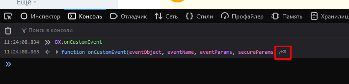
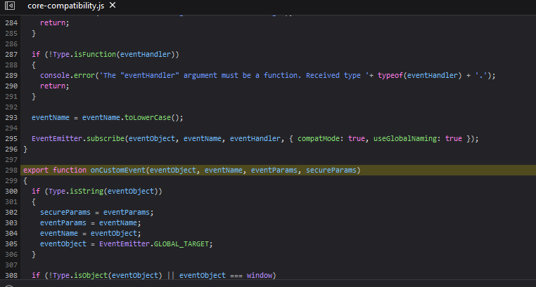
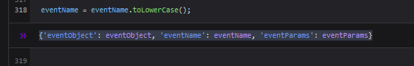
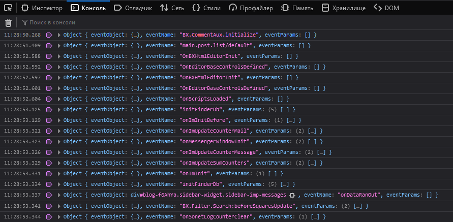

# О чем эта статья?

[TOC]

В данной статье изложены практики и методы для поиска документации и ответов на вопросы которые не изложены в данной документации. Эта статья будет полезна исследователям в поиске нужной информации, которая еще не занесена в данное руководство.

## Исследование через REST

>Если для искомого механизма существует REST метод, то его можно найти и посмотреть как он реализован. 

Модуль REST является скорее техническим модулем, нежели самостоятельным. Его архитектурная идея состоит в том, чтобы помочь другим модулям предоставив механизм для описания REST методов, а так же предоставить возможность использовать внешними системами это API. Таким образом найдя все подписки на этот модуль, можно найти все методы которые доступны через REST. 

Интересующее нас событие onRestServiceBuildDescription модуля rest. Именно на него подписываются существующие модули или произвольный php-код и дополняют существующие методы (или переопределяют). Для того чтобы определить все классы, которые предоставляют rest-методы можно выполнить фрагмент кода в Командной PHP-строке:

```php
var_dump(\GetModuleEvents('rest', 'onRestServiceBuildDescription')); 
```
>Командная PHP-строка это не cli, а специальная страница в административном разделе для выполнения произвольного php-кода

Изучая каждый класс, можно найти реализацию требуемых REST-методов.

## Исследование через название сущности

В разработке любой системы участвуют люди различного профессионализма, но ни у кого не стоит цели запутать других разработчиков, поэтому разработчики платформы стараются использовать проверенные технологии и подходы в именовании классов и методов.

Таким образом, в случае если для определенной сущности выбрано название, то оно будет фигурировать во всех связанных с ней областях. Так например, для сделки выбрано DEAL, тогда все классы так или иначе будут связаны со сделкой.

Пример:
* Класс `CCrmDeal`
* Класс `\Bitrix\Crm\DealTable`
* Класс `\Bitrix\Crm\Recycling\DealBinder`
* Константа `SONET_CRM_DEAL_ENTITY`

Этой информации достаточно для начала поиска, в то время как именование классов будет рассмотрено отдельно в соответствующем разделе.

## Исследование через css-класс или вспомогательные зацепки

Иногда может потребоваться найти вывод какого-нибудь специального фрагмента, например языковой фразы или css-класса и такой поиск может существенно затянуться, ведь они могут быть разбросаны по системе в сотнях огромных файлах.

Для этого на выручку приходят командные утилиты linux, например `grep`. Подробнее с командой можно разобраться по [доступным статьям в сети интернет](https://losst.ru/gerp-poisk-vnutri-fajlov-v-linux), мы же воспользуемся краткой выжимкой.

```bash
grep -ril 'something' ./some_path
```

Команда выполняет рекурсивный (``r``) регистро-независимый (``i``) поиск something в директории ``./some_path`` выводя исключительно файлы (``l``). 

Например, если выполнить нижеописанную команду в директории ``/home/bitrix/www/bitrix/modules/crm/lib`` 

```bash
grep -ril 'DEAL' ./
```

Можно увидеть следующий вывод (часть):
```
./preview/deal.php
./preview/route.php
./communication/manager.php
./quote.php
./binding/bindinghelper.php
./binding/contactcompany.php
./binding/orderdealtable.php
./binding/dealcontact.php
./tracking/channel/order.php
./tracking/entity.php
./tracking/internals/traceentity.php
./tracking/rest.php
./tracking/analytics/dataprovider.php
```

Иногда для исследования необходимо отследить не только конкретный фрагмент, но и его окружение, тогда полезным будет другой модификатор команды: ``n``.

Например, мы хотим найти то же слово, но нас так же интересует контекст (номер стройки и ее содержимое). Выполняем измененную команду в той же директории:  
```bash
grep -rin 'DEAL' ./
```

Можно увидеть следующий вывод (часть):
```
./phasesemantics.php:111:               if($entityTypeID === \CCrmOwnerType::Deal)
./phasesemantics.php:117:                                               self::PROCESS => GetMessage('CRM_PHASE_SEMANTICS_DEAL_PROCESS'),
./phasesemantics.php:118:                                               self::SUCCESS => GetMessage('CRM_PHASE_SEMANTICS_DEAL_SUCCESS'),
./phasesemantics.php:119:                                               self::FAILURE => GetMessage('CRM_PHASE_SEMANTICS_DEAL_FAILURE')
./phasesemantics.php:181:                       if($entityTypeName === \CCrmOwnerType::DealName)
./phasesemantics.php:183:                               $result[\CCrmOwnerType::DealName] = array(
./phasesemantics.php:184:                                       'groupTitle' => GetMessage('CRM_PHASE_SEMANTICS_DEAL_GROUP_TITLE'),
./phasesemantics.php:185:                                       'selectorTitle' => GetMessage('CRM_PHASE_SEMANTICS_DEAL_SELECTOR_TITLE'),
./phasesemantics.php:186:                                       'caption' => GetMessage('CRM_PHASE_SEMANTICS_DEAL_CAPTION'),
./phasesemantics.php:188:                                               self::UNDEFINED => GetMessage('CRM_PHASE_SEMANTICS_DEAL_UNDEFINED'),
./phasesemantics.php:189:                                               self::PROCESS => GetMessage('CRM_PHASE_SEMANTICS_DEAL_PROCESS'),
./phasesemantics.php:190:                                               self::SUCCESS => GetMessage('CRM_PHASE_SEMANTICS_DEAL_SUCCESS'),
./phasesemantics.php:191:                                               self::FAILURE => GetMessage('CRM_PHASE_SEMANTICS_DEAL_FAILURE')
./ads/adsaudience.php:71:               if (in_array($entityTypeId, array(\CCrmOwnerType::Deal, \CCrmOwnerType::Quote, \CCrmOwnerType::Invoice)))
./ads/adsaudience.php:78:                               case \CCrmOwnerType::Deal:
./ads/adsaudience.php:79:                                       $entityDb = \CCrmDeal::getListEx(array(), $subFilter);
```

Помните, что рекурсивный вызов grep может занять достаточно продолжительное время, поэтому рекомендуется ограничивать область поиска локализуя его перед тем как выполнить команду.

## Исследование JS-событий

Достаточно часто возникает ситуация когда нужно повлиять на текущую страницу, например убрать какие-либо элементы или изменить их поведение.
Зачастую неопытные разработчики пытаются применить timeout-механизм, который может сыграть с ним злую шутку и на пользовательском ПК не сработать. Наиболее правильным вариантом в данном случае будет использование событий страницы. 

В отличие от php-событий системы события публичной части не описываются и приходится искать их по всей системе, а советы которые предлагают разработчики уже не работают (привет новому коду из ES6). Как же тогда искать все вызовы?

Помощь приходит откуда не ждали: в браузере Mozilla Firefox присутствуют [механизмы отладки в браузере](https://developer.mozilla.org/en-US/docs/Tools/Debugger). Нас интересует логгирование в браузере [Set a logpoint](https://developer.mozilla.org/en-US/docs/Tools/Debugger/Set_a_logpoint).


### Алгоритм отслеживания всех событий на странице через браузер Mozilla Firefox

1. Открываем "Инструменты веб-разработчика" (стандартно: Ctrl+Shift+I)

2. Выполняем ``BX.onCustomEvent`` (без скобок)
    
    Обратите внимание на название аргументов (`eventObject, eventName, eventParams, secureParams`) - в шаге 4 необходимо использовать именно их. Если у вас будет `(e,t,r,n)` то логгировать нужно именно их!

3. Переходим по указанию расположению метода
    

4. Находим последнюю строчку перед выполнением события
    
    См. примечание к пункту 2.

5. Ставим на логгирование конструкцию
```{'eventObject': eventObject, 'eventName': eventName, 'eventParams': eventParams}```

6. Все события вызванные после установки логгирования будут выводиться в консоль.
    


