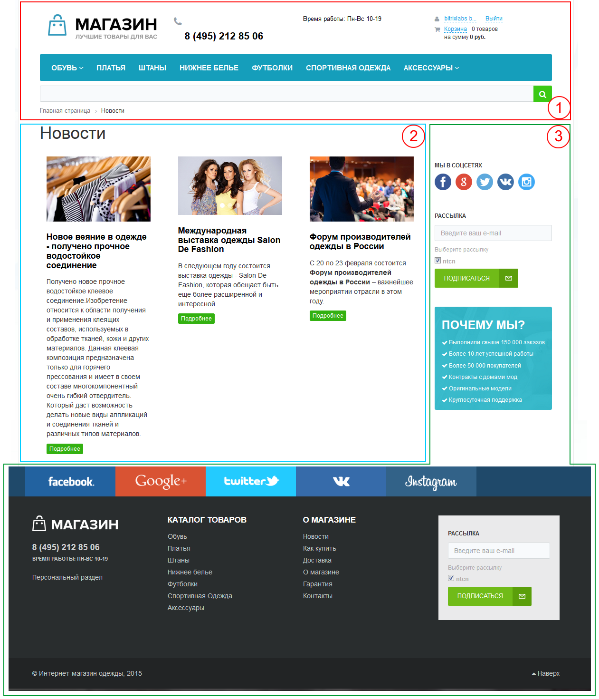
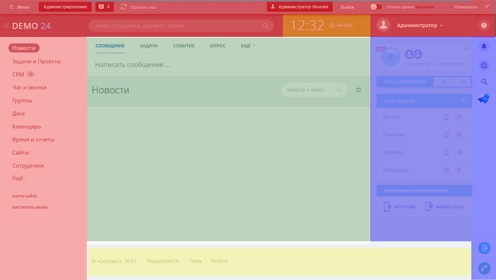

# Выполнение страницы

[TOC]

Теперь когда мы знаем как именно [обрабатывается URI](Обработка_uri) и [где не нужно располагать свои публичные страницы](Ядро_продукта), мы можем поговорить о самой странице.

Под термином `Страница` в контексте данной статьи мы будем понимать физический исполняемый файл, а не контент отображаемый в браузере пользователя. И любая страница состоит из 3 составляющих: 
* Шапка (`header`)
* Рабочая область (`workarea`)
* Подвал (`footer`)

## Шапка (`header`)

Подключается **к каждой** странице фрагментом php-кода:

```php
<?php
require($_SERVER["DOCUMENT_ROOT"]."/bitrix/header.php");
```

Структурно подключает служебную часть платформы и визуальную часть. Структурную часть мы рассмотрем позднее, а визуальная часть состои из верхней и левой часть дизайна со статической информацией (логотипом, лозунгом и так далее), верхним горизонтальным меню и левым меню (если они есть в дизайне).

## Рабочая область

Или `Тело страницы` - это часть PHP/HTML кода. Тело страницы не является частью шаблона сайта и представляет из себя индивидуальное содержимое публичной либо административной страницы.

## Подвал (`footer`)

Подключается **к каждой** странице фрагментом php-кода:

```php
<?php
require($_SERVER["DOCUMENT_ROOT"]."/bitrix/footer.php");
```

Подвал включает в себя, как правило, статическую информацию (контактная информация, сведения об авторе и владельце сайта и так далее), нижнее горизонтальное меню и правое меню (если они есть в дизайне). Может включать в себя информационные материалы. 

# Визуализация

Представить разделение для продукта `1С-Битрикс: Управление сайтом` можно при помощи изображения из официальной документации


На данном скриншоте цифрой 1 (или красной областью) обозначена шапка, цифрой 2 - рабочая область, а цифрой 3 - подвал.

Данная схема совершенно логично смотрится в `1С-Битрикс: Управление сайтом`, однако при рассмотрении `1С-Битрикс24` все становится немного сложнее. Например для главной страницы продукта будет актуальна следующая разметка:


Расшифровка цветовой индикации:
* Красный - шапка
* Желтый - подвал
* Зеленый - рабочая область
* Синий - дополнительные элементы

**Откуда в этой схеме взялся дополнительный цвет?**

Битрикс24 активно использует механизм [отложенных функций](../Разработка/Технологии/Отложенные функции), поэтому преставление на странице иногда бывает не очень наглядным. Для описания данного поведения мы не можем отнести его в ту или иную область, потому как их вызов осуществляется в одной части страницы, а фактическое отображение блока может быть в другом месте.

На рассматриваемой главной странице к таким частям можно отнеси:
* Панель виджетов справа
* Панель Веб-мессенджера

## Пример страницы

На основании изложенной выше информации, типовая 'чистая' страница без заголовка будет выглядеть следующим образом: 

```php
<?php
require($_SERVER["DOCUMENT_ROOT"]."/bitrix/header.php");
?>

Тело страницы

<?php
require($_SERVER["DOCUMENT_ROOT"]."/bitrix/footer.php");
```

## Заглядываем за кулисы

Термины `Шапка` и `Подвал` понятны и доступны всем техническим специалистам, однако на платформе за этими терминами кроются куда более интересные механизмы: `пролог` и `эпилог`. 
На самом деле `шапка` это комбинация служебной части пролога и визуальной части пролога, а `подвал` это комбинация визуальной части эпилога и служебной части эпилога. Порядок скриптов очень важен!

Таким образом, в некотором роде, страницу можно представить как комбинацию этих скриптов:

```php
<?php
require($_SERVER["DOCUMENT_ROOT"]."/bitrix/modules/main/include/prolog_before.php");

require($_SERVER["DOCUMENT_ROOT"]."/bitrix/modules/main/include/prolog_after.php");

?>

Тело страницы

<?php

require($_SERVER["DOCUMENT_ROOT"]."/bitrix/modules/main/include/epilog_before.php");

require($_SERVER["DOCUMENT_ROOT"]."/bitrix/modules/main/include/epilog_after.php");
```

Конечно, мы можем задаться вопросом *Зачем так сделано?*, однако наиболее правильной формулировкой станет *Что дает нам это разделение?*.

Подобное разделение дает гибкость в формировании страницы.
Например: можно выполнить код до вызова публичной части, но после подключения ядра системы или можно вообще использовать облегченную версию без дизайна вообще. Это очень актуально для консольных и других специальных скриптов. 

# Порядок выполнения страницы

Знать из чего состоит страница зачастую недостаточно чтобы решать определенный класс задач. Для понимания некоторых концепций и механизмов требуется понимать как именно исполняется страница.

| Шаг     | Описание   |
| :------------- | -------------------- |
| - | Служебная часть пролога (`/bitrix/modules/main/include/prolog_before.php`) |
| 1  | Подключение `/bitrix/php_interface/dbconn.php`. Подключаемый файл должен содержать определения переменных для соединения с базой данных, констант для отладки и прав доступа.               |
| 2  | Соединение с базой данных. В случае ошибки соединения будет подключен файл `/bitrix/php_interface/dbconn_error.php`.  |
| 3  | Подключение `/bitrix/php_interface/after_connect.php` и `/bitrix/php_interface/after_connect_d7.php`. Подключаемые файлы могут содержать операции, необходимые для выполнения сразу после соединения с БД. |
| 4  | Определение текущего сайта `$APPLICATION`, `SITE_ID`, `SITE_DIR`, `SITE_SERVER_NAME`, `SITE_CHARSET`, `FORMAT_DATE`, `FORMAT_DATETIME`, `LANGUAGE_ID`. Определяются все классы и функции Главного модуля.  Если к этому моменту определена константа с кодом сайта `SITE_ID`, то сайт не будет определяться по текущей папке и доменному имени, а все остальные константы будут определены для этого сайта. |
| 5  | Подключение `/local/php_interface/init.php` или `/bitrix/php_interface/init.php`. Может содержать в себе инициализацию обработчиков событий, подключение дополнительных функций - общие для всех сайтов. |
| 6  | Подключение `/bitrix/php_interface/ID сайта/init.php`. Может содержать параметры, определения функций для конкретного сайта. |
| 7  | Открытие сессии |
| 8  | Событие `OnPageStart` |
| 9  | Определение пользователя, авторизация пользователя, завершение сеанса, регистрация (в зависимости от параметров в запросе) |
| 10 | Определение текущего шаблона сайта `SITE_TEMPLATE_ID` |
| 11 | Событие `OnBeforeProlog` |
| 12 | Проверка прав доступа к физическому файлу. В случае если прав недостаточно, то выводится форма авторизации и страница завершает выполнение. |
| 13 | Начало буфферизации вывода |
| 14 | Событие OnProlog |
| -- | Визуальная часть пролога (`/bitrix/modules/main/include/prolog_after.php`) |
| 15 | Подключение `/bitrix/templates/ID шаблона сайта/header.php` |
| -- | Тело страницы |
| -- | Визуальная часть эпилога (`/bitrix/modules/main/include/epilog_before.php`) |
| 16 | Подключение `/bitrix/templates/ID шаблона сайта/footer.php` |
| 17 | Вызов функции `CMain::ShowSpreadCookieHTML`. Данная функция выводит набор невидимых IFRAME'ов используемых в Технология переноса посетителей |
| -- |Служебная часть эпилога (`/bitrix/modules/main/include/epilog_after.php`) |
| 18 | Событие `OnEpilog` |
| 20 | Завершение буферизации страницы и вывод в поток содержимое буффера  |
| 21 | Событие `OnAfterEpilog` |
| 22 | Проверка агентов |
| 23 | Отправка E-Mail писем |
| 24 | Завершение соединения с базой данных |


# Выполнение в фоновом режиме

Использование платформы не ограничивается обработкой HTTP запросов. Достаточно распространенным действием является выполнение операций в фоновом режиме, которые могут занять продолжительное время, поэтому выполнять их посредством HTTP запроса не рекомендуется. Обычно для таких операций используют фоновые задания или консольные скрипты которые в последствии устанавливаются в расписание планировщика задач `cron`. 

В чем особенность работы скрипта в консоли?
Мы не будем рассматривать работу php скрипта в консоли, а лишь обратим внимание на ограничения связанные с платформой Битрикс, накладываемые на него:
* Нет авторизованного посетителя
* Нет сессий и cookie
* Нет серверных переменных

Что это все значит?
Это значит, что код который выполняется в браузере и код который будет выполнен в консоли не обязательно будет иметь один и тот же результат. Помните, что во всех методах явно или не явно контролируются права **текущего** пользователя, которого при консольном выполнении нет. 

Пример страницы выполняющийся в фоновом режиме (например на cron):

```php
<?php
/**
 * Replace with your document root path
 * @var string
 */
$_SERVER["DOCUMENT_ROOT"] = "/home/bitrix/www";
$DOCUMENT_ROOT = $_SERVER["DOCUMENT_ROOT"];

define("NO_KEEP_STATISTIC", true);
define("STOP_STATISTICS", true);
define("NO_AGENT_STATISTIC", "Y");
define("NOT_CHECK_PERMISSIONS",true);
define("BX_NO_ACCELERATOR_RESET", true);
define("DisableEventsCheck", true);
define("NO_AGENT_CHECK", true);

require($_SERVER["DOCUMENT_ROOT"]."/bitrix/modules/main/include/prolog_before.php");

@set_time_limit(0);
@ignore_user_abort(true);

// Your code here

\CMain::FinalActions();
?>
```

Рассмотрим данную страницу с точки зрения платформы.
Битрикс активно использует `$_SERVER` переменные, которых в консольном приложении нет. Наиболее распространенной переменной, которая тянется сквозь всю систему явялестя `$_SERVER['DOCUMENT_ROOT']`. Ее следует задавать абсолютным путем от корня веб-сервера к директории в которой находится папка `bitrix`. `$DOCUMENT_ROOT` это устаревшая глобальная переменна к `$_SERVER["DOCUMENT_ROOT"]`, ее следует устанавливать в случае если на платформе возможно использование устаревших модулей или компонентов.

Скрипт является консольным, поэтому до подключения служебной части пролога, рекомендуется произвести преднастройку среды:

* Выключить сбор и обработку статистики (для модуля 'Веб-аналитика': `NO_KEEP_STATISTIC`, `STOP_STATISTICS`, `NO_AGENT_STATISTIC`)
* Выключить проверку прав (`NOT_CHECK_PERMISSIONS`)
* Запретить сброс кеша акселератора (`BX_NO_ACCELERATOR_RESET`)
* Не проверять агенты (`DisableEventsCheck`, `NO_AGENT_CHECK`)

Каждый скрипт использующий возможности платформы должен содержать как минимум подключение ее служебной части.

Затем для консольного выполнения необходио убрать лимит времени выполнения (`set_time_limit`) и отключить прерывание выполнения скрипта при отключений клиента (`ignore_user_abort`).

Подготовка закончена и теперь можно писать код, который будет делать что-то полезное. 

В ранних версиях битрикса этого было достаточно, однако с версии `20.0` необходимо обязательно подключать подвал или по крайней мере его служебную часть. Однако вместо подключения этих тяжелых вещей мы можем воспользоваться легковестным статическим методом `\CMain::FinalActions();`. 