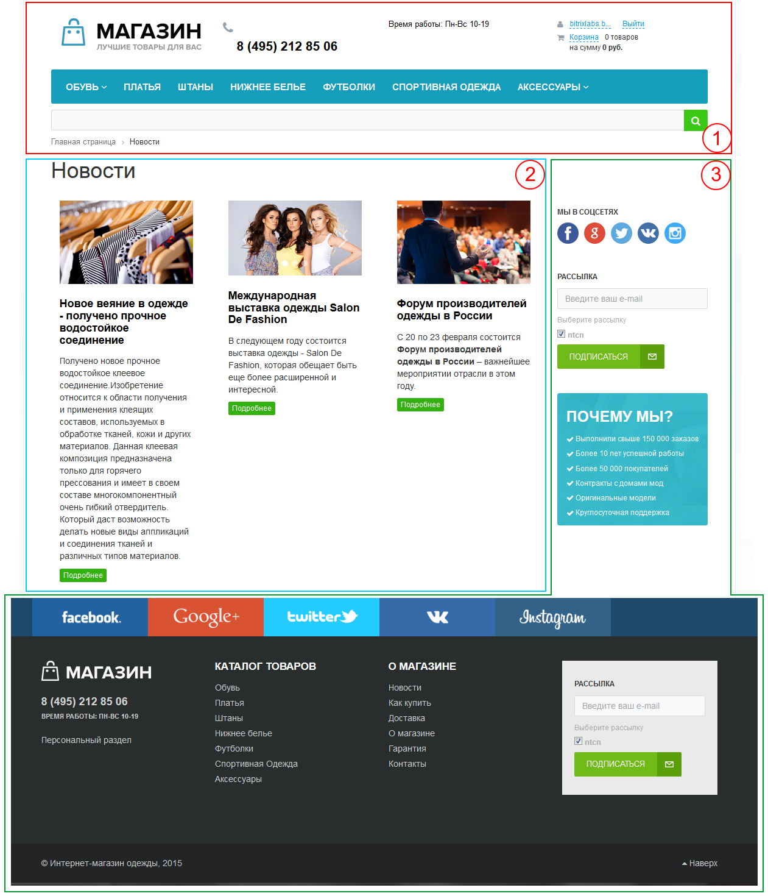

# Шаблон дизайна Битрикс24

[TOC]

В _1С-Битрикс:Управление сайтом_ шаблон является частью решения поставляемого разработчиком и может быть исправлен или доработан по решению разработчика в любой момент.

>Шаблон дизайна - это внешний вид сайта, в котором определяется расположение различных элементов на сайте, художественный стиль и способ отображения страниц. Включает в себя программный html-код, графические элементы, таблицы стилей, дополнительные файлы для отображения контента. Может также включать в себя шаблоны компонентов, шаблоны готовых страниц и сниппеты.

Битрикс24 поставляется вместе с единым системным шаблоном и он является частью решения и не подлежит изменению или копированию.

> Строго говоря, изменять системный шаблон это один из последних подходов которые только можно использовать. Крайне не рекомендуется копировать его в директорию [`local`](/03_Разработка/20_Структура_папки_local/00_Основное)

## Визуализация

Из статьи о [страницах](/02_Общие_сведения/02_Страница.md) нам уже известно о наличии технических частей - шапки и подвала и вот как представляют разделение в документации по фреймворку:

На данном скриншоте цифрой 1 (или красной областью) обозначена шапка, цифрой 2 - рабочая область, а цифрой 3 - подвал.

Данная схема совершенно логично смотрится в _1С-Битрикс: Управление сайтом_, однако при рассмотрении Битрикс24 все становится немного сложнее: например для главной страницы продукта будет актуальна следующая разметка:

Расшифровка цветовой индикации:
* Красный - шапка
* Желтый - подвал
* Зеленый - рабочая область
* Синий - дополнительные элементы

**Откуда в этой схеме взялся дополнительный цвет?**

Битрикс24 активно использует механизм [отложенных функций](../03_Разработка/100_Технологии/10_Отложенные_функции.md), поэтому преставление на странице иногда бывает не очень наглядным. Для описания данного поведения мы не можем отнести его в ту или иную область, потому что их вызов может быть в одной части страницы, а фактическое отображение блока может быть в другом месте.

На рассматриваемой главной странице к таким частям можно отнеси:
* Панель виджетов (Онлайн, Пуль, Задачи, Мобильное приложение и др.)
* Панель Веб-мессенджера (Уведомления, Открытые линии, Поиск, Чаты, Звонки)