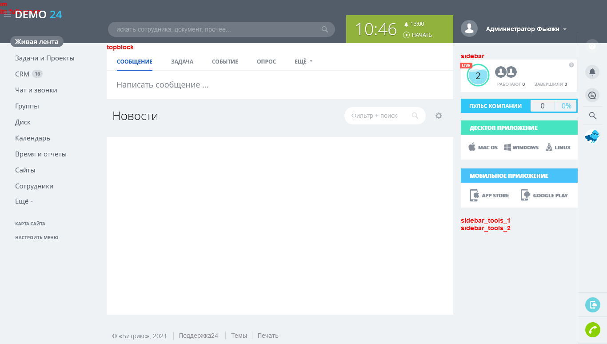
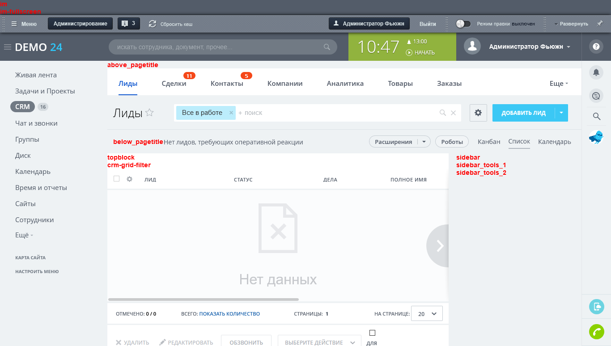

# Введение

[TOC]

Что такое отложенные функции? Это технология, позволяющая устанавливать заголовок страницы, пункты навигационной цепочки, CSS стили, дополнительные кнопки в панель управления и т.п. с помощью функций используемых непосредственно в теле страницы. Соответствующие результаты работы этих функций выводятся в другом месте нежели вызов реальной функции.

Технология была создана в первую очередь для использования в компонентах, которые, как правило, выводятся в теле страницы, но при этом внутри них могут быть заданы заголовок страницы, добавлен пункт в навигационную цепочку, добавлена кнопка в панель управления и так далее.

# Алгоритм работы технологии

Любой исходящий поток из PHP скрипта буферизируется. Алгоритм начинает работать когда встречается хотя бы одна из функций вызывающая отложенные действия.

1. Весь буферизированный до этого контент запоминается в очередном элементе стека A;
2. В стек A добавляется пустой элемент, который в дальнейшем будет заполнен результатом выполнения отложенной функции;
3. Имя отложенной функции запоминается в стеке B;
4. Буфер очищается и буферизация снова включается.

Таким образом, существует стек A, в котором находится весь контент страницы, разбитый на части. В этом же стеке есть пустые элементы, предназначенные для их дальнейшего заполнения результатами отложенных функций.

Также существует стек B, в котором запоминаются имена и параметры отложенных функции в порядке их следования в коде.

В конце страницы в служебной части эпилога выполняются следующие действия:
1. Все отложенные функции из стека B начинают выполняться одна за другой;
2. Результаты их выполнения вставляются в специально предназначенные для этого места в стек A;
3. Весь контент из стека A "склеивается" (конкатенируется) и выводится на экран.

Таким образом, технология позволяет фрагментировать весь контент страницы, разбивая его на части с помощью специальных функций, обеспечивающих временное откладывание выполнения других функций (отложенных функций). В конце страницы все отложенные функции выполняются одна за другой и результаты их выполнения вставляются в отведенные для этого места внутри фрагментированного контента страницы. Затем весь контент склеивается и отправляется браузеру посетителя сайта.

# Виды

На платформе технология представлена в виде нестатического метода `CMain::AddBufferContent` и все использование отложенных функций так или иначе сводится к ее использованию, однако существует несколько вариантов реализации конкретных отложенных функций.

Для рассмотрения таких особенностей, чтобы не вводить читателей в заблуждение мы искусственно введем свою терминологию и классифицируем их по месту применения как:

* Общие (BufferContent)
* Компонентные (ViewTarget)

# Особенности работы

Так как работа механизма обеспечивается благодаря системе буферизации вывода это накладывает определенные отпечатки на его работу. 

Буферизация собирает только реально выводимый на страницу контент, а это значит что внутри отложенной функции можно подключать любые компоненты, но при этом необходимо вручную подключать любые дополнительные файлы, например CSS и JS.

Общие отложенные функции нельзя использовать в файлах шаблона компонента, таких как `template.php` и `result_modifier.php` кешируются, однако компонентные отложенные функции могут применяться внутри таких областей без ограничений.

Стоит учитывать, что при использовании любого вида отложенных функций над результатами работы, обеспечивающих откладывание других функций, нельзя выполнять какие-либо действия. Значение, возвращаемое отложенной функцией, не возвращается, а сразу выводится в месте вызова AddBufferContent, а всё, что выводится в отложенной функции, будет выведено до начала шаблона.


# Примеры общих отложенных функций

Наиболее распространенные примеры отложенных функций в Битрикс24:

**CMain::ShowTitle**

Вывод названия страницы (обычно в заголовок), откладывает выполнении `CMain::GetTitle`, которое задается через `CMain::SetTitle`.

**CMain::ShowPanel**

Вывод названия страницы (обычно в заголовок), откладывает выполнении `CMain::GetPanel`, которое задается через `CMain::AddPanelButton`.

**CMain::ShowCSS**

Вывод названия страницы (обычно в заголовок), откладывает выполнении `CMain::GetCSS`, которое задается через `CMain::SetTemplateCSS` и `CMain::SetAdditionalCSS`.

**CMain::ShowProperty**

Вывод названия страницы (обычно в заголовок), откладывает выполнении `CMain::GetProperty`, которое задается через `CMain::SetPageProperty` и `CMain::SetDirProperty`.

# Разработка своей общей отложенной функции

Весь механизм обеспечивается работой статического метода `CMain::AddBufferContent` (подробнее можно [ознакомиться в документации](https://dev.1c-bitrix.ru/api_help/main/reference/cmain/addbuffercontent.php)).

```php
CMain::AddBufferContent(
 callback function,
 mixed parameter_1,
 mixed parameter_2,
 ...
 mixed parameter_N
)
```

Давайте разработаем свою отложенную функцию по выводу meta-информации. В нашем примере мы используем класс со статической переменной для хранения последнего значения:

```php
class LastValueDeferredBufferContent
{
    static $lastValue;

    public static function set( $value )
    {
        static::$lastValue = $value;
    }

    public static function get()
    {
        return static::$lastValue;
    }
}
```

Мы определили класс со статической переменной которая хранит последнее заданное значение. Зарегистрированная отложенная функция будет выглядеть следующим образом:

```php
function getLastValueFromDeferredBufferContent()
{
    global $APPLICATION;
    $APPLICATION->AddBufferContent(['LastValueDeferredBufferContent', "get"]);
}

```

Давайте протестируем написанное содержимое:

```php

LastValueDeferredBufferContent::set(0);

/**
 * Display: 9
 */
echo getLastValueFromDeferredBufferContent(); 

for( $i = 0; $i<10, $i++)
{
    LastValueDeferredBufferContent::set($i);
}

```

Как видите, несмотря на то, что приложение было предзаполнено `0`, пользователю в браузер вывелось `9`. 

# Разработка своей компонентной отложенной функции

Компонентные отложенные функции работают иначе - они используют специальный глобальный буфер для запоминания содержимого и локальный буфер компонента, чтобы иметь возможность использовать результат отложенного содержимого даже в кеширующемся компоненте.

Важно отметить, что несмотря на наличие такой возможности, данные, сохраняемые в буфере, не являются динамическими. Что это значит? Это значит что локальный буфер компонента использует кеш компонента и контент который попадет в локальный буфер при первом выводе компонента с включенным кешированием будет отображаться в области до момента создания нового кеша.

Давайте предположим, что у нас на странице есть некоторый компонент `bx24devbook:article.detail` и мы хотим вывести часть содержимого под заголовок страницы в область `below_pagetitle` (существующие области мы рассмотрим позднее). 

Для того чтобы это сделать, в используемом шаблоне компонента (`template.php` или любой другой подключаемый php-файл) мы должны вызвать следующие функции:

```php
$this->SetViewTarget('below_pagetitle');

?>Some content<?

$this->EndViewTarget();
```
Этого достаточно для отображения содержимого в нужной нам области.

**Можно ли использовать данный механизм вне компонента?**

На этот вопрос можно ответить как положительно, так и отрицательно.
Да, можно вывести произвольное содержимое в эти области из любого исполняемого кода в рамках страницы. Для этого необходимо воспользоваться нестатическим методом `CMain::AddViewContent`.

Например, для приведенного выше фрагмента, аналогом может выступить:
```php
global $APPLICATION;
$APPLICATION->AddViewContent(
    'below_pagetitle',
    'Some content'
);
```

Подробнее с указанным методом можно [ознакомиться в документации](https://dev.1c-bitrix.ru/api_help/main/reference/cmain/addviewcontent.php).

**Можно ли создавать свои области?**

В приведенном примере мы рассматривали область `below_pagetitle`, однако вы можете создавать и свои собственные области. Помните: не следует размещать их внутри кешируемой области.

За создание такой области отвечает метод `ShowViewContent` из нестатического класса `CMain` (его инстанс содержится в глобальной переменной `$APPLICATION`).

```php
$APPLICATION->ShowViewContent("some_location_name");
```

# Полезные области шаблона bitrix24

Внутри шаблона уже определено некоторое количество областей, которые вы можете использовать в своих разработках:



Небольшое перечисление с особенностями использования:

* `im` и `im-fullscreen` - вначале контентной области. Не рекомендуется к использованию.
* `sidebar`, `sidebar_tools_1`, `sidebar_tools_2` - вертикальный блок справа
* `topblock` - в начале содержимого контентной области
* `above_pagetitle` - перед строкой с заголовком
* `below_pagetitle` - после строки заголовка, но до контентной области

Стоит отметить так же пару областей с особым применением, ввиду использования механизма ui.toolbar: 

* `pagetitle` - область справа от заголовка до кнопок.
* `inside_pagetitle` - область кнопок справа от заголовка страницы.

Дело в том, что данные блоки не используются когда используется работа компонента `bitrix:ui.toolbar`.


