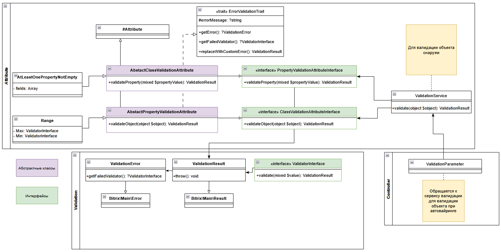

# Валидаторы

[TOC]

Валидация это процесс проверки проверки данных на соответствие определенным правилам/условиями и этот процесс является распространенней задачей в веб-приложениях. Распространенными задачами является валидация данных отправленных форм, валидация перед записей в базу данных или передачей в сервисы.


## Концепция

Основная концепция решения состоит в том, что в продукте существует единый сервис валидации `\Bitrix\Main\Validation\ValidationService`, обратиться к которому можно через [Локатор служб](/03_Разработка/100_Технологии/40_Локатор_служб.md) по ключу `main.validation.service`, а на вход валидатора подать любой php-объект, размеченный в соответствии правилами, о которых поговорим далее.



Пример использования валидатора:

```php
use Bitrix\Main\DI\ServiceLocator;
use Fusion\Gamification\Accrual;

$accrual = new Accrual();

$validation = ServiceLocator::getInstance()->get('main.validation.service');

/**
 * @var Bitrix\Main\Validation\ValidationResult
 * Наследник \Bitrix\Main\Result
 */
$result = $validation->validate($accrual);

if (!$result->isSuccess()) {

	/**
	 * Произошли ошибки, который можно получить через $result1->getErrors()
	 * 
	 * Каждая ошибка валидации - Bitrix\Main\Validation\ValidationError
	 * 
	 */
	foreach ($result->getErrors() as $error) {
		echo sprintf(
			"В поле %s ошибка %s",
			$error->hasCode()? $error->getCode() : '[Общее]',
			$error->getMessage()
		);

		/**
		 * Получить валидатор, который выдал ошибку можно через: 
		 * $failedValidator = $error->getFailedValidator();
		 */
	}
}
```

## Использование

Валидация это не магия и Битрикс не знает как нужно валидировать именно ваш объект, поэтому для корректной работы механизма необходимо чтобы свойства вашего объекта был размечены правилами валидации.
В приведенном выше примере я отправил на валидацию объект класса `Fusion\Gamificaiton\Accrual`, поэтому давайте рассмотрим его подробнее.

```php
namespace Fusion\Gamification;

class Accrual
{

	public function __construct(
		/**
		 * Кому начисляем деньги
		 * Обязательное поле!
		 * @var int
		 */
		public int $userId,

		/**
		 * Количество монет для начисления сотруднику
		 * Обязательное поле!
		 * @var int
		 */
		public int $coinCount,

		/**
		 * Примечение к начислению
		 * Обязательное поле!
		 * @var string
		 */
		public string $desc
	)
	{
	}
}
```

Это небольшой класс DTO-типа, который имеет следующие свойства:
- `$userId` - идентификатор сотрудника, который получает игровую валюту
- `$coinCount` - количество игровой валюты к начислению
- `$desc` - какое-то примечание к начислению

Какие проверки нужно реализовать чтобы структура была корректна?
Очевидно, что как минимум нам нужно запонить все поля ведь без этого нам php просто не даст создать объект, но если вы считаете что этого достаточно я вас разочарую - выдать 0 монет пользователю с ID:0 не является корректным поведением так же как и выдача -100 монет для пользователя ID:-1, а пустая строка или даже строка с пробелом в качестве примечания не является корректной.

Для того чтобы проверить правильность заполнения объекта пришлось бы делать проверки:

```php

public function validateAccrual( Accrual $accrual ): Result
{
	$result = new Result();

	if ($accrual->userId <= 0) {
		$result->addError(new Error("Идентификатор пользователя должен быть больше 0"));
	}

	if ($accrual->coinCount <= 0) {
		$result->addError(new Error("Количество монет для начисления должно быть больше 0"));
	}
	
	if ($accrual->coinCount <= 0) {
		$result->addError(new Error("Количество монет для начисления должно быть больше 0"));
	}

	if ( mb_strlen(trim($accrual->desc)) === 0 ) {
		$result->addError(new Error("Примечание является обязательным полем"));
	}

	return $result;
}
```

С ростом числа параметров и сложности валидации количество проверок и правил будет расти, а возможности переиспользовать правила нет.
Давайте изменим наш класс для соответствия валидатору: 


```php
namespace Fusion\Gamification;

use Bitrix\Main\Validation\Rule\NotEmpty;
use Bitrix\Main\Validation\Rule\PositiveNumber;

class Accrual
{
	public function __construct(
		/**
		 * Кому начисляем деньги
		 * @var int
		 */
		#[PositiveNumber]
		public int $userId,

		/**
		 * Количество монет для начисления сотруднику
		 * @var int
		 */
		#[PositiveNumber]
		public int $coinCount,

		/**
		 * Примечение к начислению
		 * @var string
		 */
		#[NotEmpty]
		public string $desc = ""
	)
	{
	}
}
```

Всего 5 строчек в классе `Accrual` и весь `validateAccrual` можно заменить "одной" строчкой:

```php
$result = ServiceLocator::getInstance()
	->get('main.validation.service')
	->validate($accrual);
```

Важные примечания валидации:
1. Модификаторы доступа у свойств не учитываются, валидация происходит через рефлексию.
2. Если атрибут nullable и его значение не установлено, он будет пропущен при валидации.

## Пример

```php
use Bitrix\Main\DI\ServiceLocator;
use Bitrix\Main\Validation\Rule\NotEmpty;
use Bitrix\Main\Validation\Rule\PositiveNumber;

class Accrual
{
	public function __construct(
		/**
		 * Кому начисляем деньги
		 * @var int
		 */
		#[PositiveNumber]
		public int $userId,

		/**
		 * Количество монет для начисления сотруднику
		 * @var int
		 */
		#[PositiveNumber]
		public int $coinCount,

		/**
		 * Примечение к начислению
		 * @var string
		 */
		#[NotEmpty]
		public string $desc
	)
	{
	}
}

$accrual = new Accrual(
	userId: -1,
	coinCount: 100,
	desc: ""
);

$validation = ServiceLocator::getInstance()->get('main.validation.service');

$result = $validation->validate($accrual);

if (!$result->isSuccess()) {
	foreach ($result->getErrors() as $error) {
		echo sprintf(
			"В поле %s ошибка %s",
			$error->hasCode()? $error->getCode() : '[Общее]',
			$error->getMessage()
		);
	}

	return;
}

/**
 * Результат выполнения:
 * 
 * В поле userId ошибка Значение поля должно быть не меньше, чем 1
 * В поле desc ошибка Значение поля не может быть пустым
 */

```

## Комплексные объекты

Комплексные объекты это те, которые в качестве валидируемых свойств содержат объекты которые так же должны быть провалидированы. Не спешите придумывать костыли и велосипеды в продукте предусмотрена механизм для рекурсивной валидации `\Bitrix\Main\Validation\Rule\Recursive\Validatable` - обратимся к примерам в документации:

```php

use Bitrix\Main\DI\ServiceLocator;
use Bitrix\Main\Validation\Rule\Recursive\Validatable;
use Bitrix\Main\Validation\Rule\NotEmpty;
use Bitrix\Main\Validation\Rule\PositiveNumber;


class Buyer
{
	public function __construct(
		#[PositiveNumber]
		public ?int $id,
		#[Validatable]
		public ?Order $order
	)
	{
	}
}

class Order
{
	public function __construct(
		#[PositiveNumber]
		public int $id,
		#[Validatable]
		public ?Payment $payment
	)
	{
	}
}

class Payment
{
	public function __construct(
		#[NotEmpty]
		public string $status,
		#[NotEmpty(errorMessage: 'Custom message error')]
		public string $systemCode
	)
	{
	}
}


$buyer = new Buyer(
	id: 123,
	order: new Order(
		id: 0,  // <--- Допустили ошибку
		payment: new Payment(
			status: '', // <-- Допустили ошибку
			systemCode: '' // <-- Допустили ошибку
		)
	)
);

$validationResult = ServiceLocator::getInstance()
	->get('main.validation.service')
	->validate($buyer);

foreach ($validationResult->getErrors() as $error)
{
    echo sprintf(
    	"%s: %s\r\n",
    	$error->getCode(),
    	$error->getMessage()
    );
}

/**
 * Результат выполнения:
 * 
 * order.id: Значение поля должно быть не меньше, чем 1
 * order.payment.status: Значение поля не может быть пустым
 * order.payment.systemCode: Custom message error
 */
```

## Полезные ссылки

1. [Валидаторы в документации](https://dev.1c-bitrix.ru/api_d7/bitrix/main/validation/index.php)
