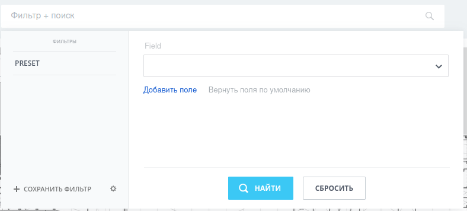

# Обзор компонента

[TOC]

Системный компонент `bitrix:main.ui.filter` обеспечивает отображение фильтра на странице и отвечает за визуальную часть блока "фильтр + поиск".
Для более углубленного изучения, его можно найти в директории `bitrix/components/bitrix/main.ui.filter/` вашего проекта.

Немного терминологии:
- Фильтром в контексте этой статьи называется весь компонент обеспечивающий работу фильтрации.
- Поле - это выведенные в компоненте фильтра управляющие элементы, обеспечивающие фильтрации по какому-либо признаку
- Пресет - именованная группировка полей фильтра, которая может содержать предустановленные значения
- Конфигурация поля - мета-информация о поле, описывает тип, обязательность, множественность и т.п.

## Параметры компонента

| Параметр | Описание |
| :--- | --- |
| `FILTER_ID` (string) | - уникальный идентификатор фильтра, используемый для отделения его от других фильтров в продукте. Единственный обязательный параметр компонента. |
| `GRID_ID` (string) | - опциональный параметр идентификатор связанного грида. Если заполнен, то некоторые действия грида и фильтра будут связаны. Например при применении фильтра грид будет автоматически обновлен. |
| `FIELDS` (array) | - набор полей для фильтра. Подробнее в главе "Поля фильтра" |
| `RENDER_FILTER_INTO_VIEW` (string) | - код включаемой области для отрисовки фильтра |
| `RENDER_FILTER_INTO_VIEW_SORT` (int) | - приоритет для отрисовки в включаемой области (по-умолчанию 500) |
| `SETTINGS_URL` (string) | - относительный url к файлу, который управляет настройками фильтра. По-умолчанию ссылается на файл `settings.ajax.php` в папке компонента |
| `FILTER_ROWS` (array) | - набор идентификаторов полей фильтра находящихся на странице при первоначальной отрисовке (поля по-умолчанию или поля из последнего пресета) |
| `CURRENT_PRESET` (string) | - пресет из набора, переданного в параметрах `FILTER_PRESETS`, который выбран при открытии. |
| `ENABLE_LABEL` (bool) | - флаг, отвечающий за вывод названий полей в фильтре. |
| `DISABLE_SEARCH` (bool) | - в случае `true` будет доступен только фильтр без поиска. Семантически  похож на `ENABLE_LIVE_SEARCH`, поэтому последний не рассматривается |
| `LIMITS` (array) | - ассоциативный массив описываюший предупреждение с лимитами. Подробнее в главе "Лимиты" |
| `RESET_TO_DEFAULT_MODE` (bool) | - флаг, отвечающий за поведение ворзвращения фильтра на закрепленный пресет. В случае когда пользователь имеет закрепленный пресет, затем выбирает другой фильтр и отменяет его, то в случае `true` (по-умолчанию) фильтр вернется в закрепленный пресен |
| `LAZY_LOAD` (array) | - массив ссылок, отвечающий за ленивую подгрузку данных. Подробнее в главе "Ленивая подгрузка данных" |
| `MESSAGES` (array) |- массив языковых фраз для переопределения. Подробнее в главе "Переопределение языковых фраз фильтра" |
|`FILTER` (array) | - набор конфигураций полей фильтра. |
| `FILTER_ROWS` (array) | - опциональный параметр показывающий какие поля из `FILTER` сейчас находятся на форме. Если не передан - будет вычислен из полей `FILTER` и пресета пользователя. По сути ассоциативный массив `<k> => <v>`, где `k` - код поля, а `v` - bool-значение, `true` если отображается |
| `FILTER_PRESETS` (array) | - набор пресетов, отображающихся у пользователей как системные (их нельзя удалить). В фильтре всегда есть пресет с кодом `default_filter`, добавлять его самому не нужно, но и переопределять его не имеет смысла - он будет добавален автоматически компонентом. |
| `COMMON_PRESETS_ID` (string) | - пресет из списка `FILTER_PRESETS`, являющийся основным (т.е. по-умолчанию) при открытии страницы. |
| `CONFIG` (array) | - массив дополнительной приоритетной информации относительно конфигурации пользователя. Подробнее он разобран в "Поведение ключа `CONFIG`". |
| `VALUE_REQUIRED` (bool) | - нужно ли контролировать в фильтре обязательные параметры. В случае если параметр `true`, будет выполнен поиск обязательных полей и принудительный вывод на выбранный экран. Обязательные поля нельзя будет удалить из отображения фильтра. |
| `VALUE_REQUIRED_MODE` (bool) | Дополнительный флаг меняющий поведение фильтра без параметров. Дополняет стандартное поведение `VALUE_REQUIRED`. |
| `THEME` | - идентификатор темы применяемой для фильтра. Подробнее в главе "Темы для фильтра" |
| `ENABLE_ADDITIONAL_FILTERS` | `true` если в фильтре используются дополнительные опции (например "Значение отсутствует") |
| `ENABLE_FIELDS_SEARCH` | `true` если в фильтре разрешен поиск полей при добавлении нового поля на форму |
| `HEADERS_SECTIONS` |  |
| Языковые параметры | Подробнее в главе "Переопределение языковых фраз фильтра" |

### Отображаемый вид открытого фильтра



### Изменение фильтра через `apply_filter` и POST-запрос

Существует возможность задавать заранее выбранные значения через query string (GET) параметры страницы, при условии `POST` запроса к странице.
При открытии страницы, проверяется наличие POST-параметра `apply_filter` и если там находится `Y`, происходит замена пользовательского фильтра переданного в GET-параметре `filter_id` на значения переданные при отправке запроса (читается как GET, так и POST параметры - порядок - сначала GET, потом POST накладываются друг на друга заменяя).


### Поведение ключа `CONFIG`

Прежде чем говорить о содержимом параметра `CONFIG` и его влиянии на поведение необходимо сказать что итоговая конфигурация получается путем объединения 3 конфигурационных массивов:
- Информация из файла `themesPath/config.json`
- Информация из файла `themesPath/themeName/config.json`
- Информация из параметра `CONFIG`

`themesPath` - путь к директории темы
`themeName` - название темы

Рассмотрим какие опции можно использовать:
- `SEARCH` (bool) - дополнительный параметр, который учитывается в качестве условия "или" для возможности поиска. Поиск будет недоступен если `DISABLE_SEARCH = true` ИЛИ `SEARCH = false`. Если в `DISABLE_SEARCH = true`, параметр `SEARCH = false` не имеет силы.
- `DEFAULT_PRESET` (bool) - разрешает или запрещает устанавливать перест по-умолчанию. Пресеты создавать можно, закреплять (т.е. делать по-умолчанию) нельзя.
- `FILTER_SHOW_DELAY` (int) - примерное количество милисекунд (1000 = 1 секунда) прежде чем нажатие по строке приведет к открытию фильтра 
- `FILTER_CLOSE_DELAY` (int) - примерное количество милисекунд (1000 = 1 секунда) прежде чем фактическое закрытие фильтра приведет к исчезновению всплывающего окна с полями фильтрации 
- `AUTOFOCUS` (bool) - если установлено (`true`), при открытии страницы фокус будет перемещен на фильтр
- `POPUP_BIND_ELEMENT_SELECTOR` (string) - css селектор, по которому будет производится поиск во всем DOM-дереве для позиционирования фильтра относительно этого элемента.  
- `POPUP_OFFSET_LEFT` (int) - смещение (в пикселях) влево относительно элемента для которого осуществляется позиционирование
- `POPUP_OFFSET_TOP` (int) - смещение (в пикселях) вверх относительно элемента для которого осуществляется позиционирование

Это не полный список параметров которые можно перекрывать.
Большая часть параметров отвечает за визуальное отображение и не рекомендуется к перекрытию.
Часть общих параметров не описана потому что потеряла актуальность и более не используется.

## Поля фильтра

Каждый фильтр состоит из набора полей (не ассоциативынй список), где каждое поле описывается некоторыми параметрами:

| Поле            | Тип       | Описание |
| :-------------- | --------- | -------- |
| `id`            | `string`  | Код поля |
| `name`          | `string`  | Отображаемое название поля |
| `type`          | `string`  | См. допустимые типые полей под таблицей |
| `placeholder`   | `string`  | Текст в поле ввода. Допустим не для всех полей. |
| `params`        | `array`   | Набор дополнительных параметров поля |
| `required`      | `bool`    | Является ли поле обязательным |
| `valueRequired` | `bool`    | Должно ли поле быть заполнено явно |
| `strict`        | `bool`    | Усиленная проверка полей (при включенном режиме дополнительных фильтров) |
| Типизированные  | --------- | Зависят от выбранного типа. См. дополнительное описание полей |

Актуальные допустимые типы поле в фильтре описаны константами в классе `Bitrix\Main\UI\Filter\FieldAdapter`.
На момент написания статьи это типы (в скобках указано их значение):
- `STRING` (`string`) - строка
- `TEXTAREA` (`textarea`) - многострочный текст
- `NUMBER` (`number`) - число
- `DATE` (`date`) - дата (дата со временем)
- `LIST` (`list`) - список
- `DEST_SELECTOR` (`dest_selector`) - привязка dest-селектора
- `ENTITY_SELECTOR` (`entity_selector`) - привязка entity-селектора
- `CUSTOM` (`custom`) - пользовательский тип (общий)
- `CUSTOM_ENTITY` (`custom_entity`) - пользовательский тип сущности
- `CUSTOM_DATE` (`custom_date`) - пользовательская дата
- `CHECKBOX` (`checkbox`) - Да/Нет

В параметрах (`params`) полей могут передаваться дополнительные правила поведения полей.
Например для создания множественного поля, в параметрах нужно передать `multiple` со значением `true` (bool), либо `Y` (string).


### Дополнительные возможности полей

Стандартное описание полей и параметров гибко зависят от типа поля. Некоторые типы полей требуют своих спецэффических настроек, а некоторые параметров. В этой главе мы будем рассматривать настройку таких полей.

При рассмотрении предполагаем что в коде у нас прописаны следующие сокращения:
```php
use Bitrix\Main\UI\Filter\FieldAdapter;
```

#### Поле типа Список (`FieldAdapter::LIST`).
В своем наборе полей ожидает получить дополнительный ключ `items`, который бы являлся ассоциативным массивом ключ=>значение, где ключ - реальное значение поля (которое будет использоваться в коде), а значение это отображаемый пользователю текст.

Пример описания поля типа список, не обязательного к заполнению с двумя вариантами. 
```php
[
	`id`       => 'EXAMPLE_LIST',
	`name`     => "List field example",
	'type'     => FieldAdapter::LIST,
	'required' => false,
	'items'    => [
		"value_a" => "Display value of A",
		"value_b" => "Display value of B",
	],
]
```

В случае использования не множественного необязательного поля в список `items` дополнительно будет добавлен технический элемент ключем которого выступит пустая строка, а значением - языковая фраза с кодом `MAIN_UI_FILTER__NOT_SET`.


#### Поле типа Число (`FieldAdapter::NUMBER`)

В своем наборе полей может принять дополнительно следующие поля:

1. `messages` - Ассоциативный массив `(string) => string` языковых фраз для приоритетного замещения стандартных.
На момент написания статьи обрабатывает следующие языковые фразы:

| Код фразы                         | Значение на русском |
| :-------------------------------- | ------------------- |
| MAIN_UI_FILTER__NUMBER_SINGLE     | Точно               |
| MAIN_UI_FILTER__NUMBER_RANGE      | Диапазон            |
| MAIN_UI_FILTER__NUMBER_MORE       | Больше чем          |
| MAIN_UI_FILTER__NUMBER_LESS       | Меньше чем          |
| MAIN_UI_FILTER__NUMBER_BEFORE_N   | Предыдущие N        |

2. `exclude` - перечисление стандартных подтипов поля, которые не нужно отображать.
По-умолчанию все стандартные подтипы добавляются к полю и могут быть выбраны пользователем.

Допустимые значения:
```
\Bitrix\Main\UI\Filter\NumberType::SINGLE,
\Bitrix\Main\UI\Filter\NumberType::RANGE,
\Bitrix\Main\UI\Filter\NumberType::MORE,
\Bitrix\Main\UI\Filter\NumberType::LESS,
```

3. `include` - перечисление дополнительных подтипов, которые нужно отображать.
На данный момент доступно только:
```
\Bitrix\Main\UI\Filter\AdditionalNumberType::BEFORE_N
```

Пример как будет выглядеть описание обязательного поля типа Число, в возможнымии дополнительными значениями только "Предыдущие Н" (переименованным в "Рабочих дней назад":
```php
[
	`id`       => 'EXAMPLE_NUMBER',
	`name`     => "Number fields example",
	'type'     => FieldAdapter::NUMBER,
	'required' => true,
	'exclude'  => [
		\Bitrix\Main\UI\Filter\NumberType::SINGLE,
		\Bitrix\Main\UI\Filter\NumberType::RANGE,
		\Bitrix\Main\UI\Filter\NumberType::MORE,
		\Bitrix\Main\UI\Filter\NumberType::LESS,
	],
	'include'  => [
		\Bitrix\Main\UI\Filter\AdditionalNumberType::BEFORE_N
	],
]
```

#### Поле типа Дата (`FieldAdapter::DATE`)

В своем наборе полей может принять дополнительно следующие поля:

1. `time` (bool) - позволять выбрать время

2. `messages` - Ассоциативный массив `(string) => string` языковых фраз для приоритетного замещения стандартных.
На момент написания статьи обрабатывает следующие языковые фразы:

| Код фразы                                       | Значение на русском |
| :---------------------------------------------- | ------------------- |
| MAIN_UI_FILTER_FIELD_MONTH_1                    | Январь              |
| MAIN_UI_FILTER_FIELD_MONTH_2                    | Февраль             |
| MAIN_UI_FILTER_FIELD_MONTH_3                    | Март                |
| MAIN_UI_FILTER_FIELD_MONTH_4                    | Апрель              |
| MAIN_UI_FILTER_FIELD_MONTH_5                    | Май                 |
| MAIN_UI_FILTER_FIELD_MONTH_6                    | Июнь                |
| MAIN_UI_FILTER_FIELD_MONTH_7                    | Июль                |
| MAIN_UI_FILTER_FIELD_MONTH_8                    | Август              |
| MAIN_UI_FILTER_FIELD_MONTH_9                    | Сентябрь            |
| MAIN_UI_FILTER_FIELD_MONTH_10                   | Октябрь             |
| MAIN_UI_FILTER_FIELD_MONTH_11                   | Ноябрь              |
| MAIN_UI_FILTER_FIELD_MONTH_12                   | Декабрь             |
| MAIN_UI_FILTER_FIELD_QUARTER_1                  | I                   |
| MAIN_UI_FILTER_FIELD_QUARTER_2                  | II                  |
| MAIN_UI_FILTER_FIELD_QUARTER_3                  | III                 |
| MAIN_UI_FILTER_FIELD_QUARTER_4                  | IV                  |
| MAIN_UI_FILTER_FIELD_SUBTYPE_NONE               | Любая дата          |
| MAIN_UI_FILTER_FIELD_SUBTYPE_YESTERDAY          | Вчера               |
| MAIN_UI_FILTER_FIELD_SUBTYPE_CURRENT_DAY        | Сегодня             |
| MAIN_UI_FILTER_FIELD_SUBTYPE_TOMORROW           | Завтра              |
| MAIN_UI_FILTER_FIELD_SUBTYPE_CURRENT_WEEK       | Текущая неделя      |
| MAIN_UI_FILTER_FIELD_SUBTYPE_CURRENT_MONTH      | Текущий месяц       |
| MAIN_UI_FILTER_FIELD_SUBTYPE_CURRENT_QUARTER    | Текущий квартал     |
| MAIN_UI_FILTER_FIELD_SUBTYPE_LAST_7_DAYS        | Последние 7 дней    |
| MAIN_UI_FILTER_FIELD_SUBTYPE_LAST_30_DAYS       | Последние 30 дней   |
| MAIN_UI_FILTER_FIELD_SUBTYPE_LAST_60_DAYS       | Последние 60 дней   |
| MAIN_UI_FILTER_FIELD_SUBTYPE_LAST_90_DAYS       | Последние 90 дней   |
| MAIN_UI_FILTER_FIELD_SUBTYPE_PREV_DAYS          | Последние N дней    |
| MAIN_UI_FILTER_FIELD_SUBTYPE_NEXT_DAYS          | Следующие N дней    |
| MAIN_UI_FILTER_FIELD_SUBTYPE_MONTH              | Месяц               |
| MAIN_UI_FILTER_FIELD_SUBTYPE_QUARTER            | Квартал             |
| MAIN_UI_FILTER_FIELD_SUBTYPE_YEAR               | Год                 |
| MAIN_UI_FILTER_FIELD_SUBTYPE_EXACT              | Точная дата         |
| MAIN_UI_FILTER_FIELD_SUBTYPE_LAST_WEEK          | Прошлая неделя      |
| MAIN_UI_FILTER_FIELD_SUBTYPE_LAST_MONTH         | Прошлый месяц       |
| MAIN_UI_FILTER_FIELD_SUBTYPE_RANGE              | Диапазон            |
| MAIN_UI_FILTER_FIELD_SUBTYPE_NEXT_WEEK          | Следующая неделя    |
| MAIN_UI_FILTER_FIELD_SUBTYPE_NEXT_MONTH         | Следующий месяц     |
| MAIN_UI_FILTER_FIELD_SUBTYPE_CUSTOM_DATE        | Произвольная дата   |
| MAIN_UI_FILTER_FIELD_SUBTYPE_PREV_DAY           | Предыдущий N день   |
| MAIN_UI_FILTER_FIELD_SUBTYPE_NEXT_DAY           | Следующий N день    |
| MAIN_UI_FILTER_FIELD_SUBTYPE_MORE_THAN_DAYS_AGO | Более N дней назад  |
| MAIN_UI_FILTER_FIELD_SUBTYPE_AFTER_DAYS         | Через N дней        |

3. `exclude` - перечисление стандартных подтипов поля, которые не нужно отображать.
По-умолчанию все стандартные подтипы добавляются к полю и могут быть выбраны пользователем.

Допустимые значения:
```
\Bitrix\Main\UI\Filter\DateType::NONE
\Bitrix\Main\UI\Filter\DateType::YESTERDAY
\Bitrix\Main\UI\Filter\DateType::CURRENT_DAY
\Bitrix\Main\UI\Filter\DateType::TOMORROW
\Bitrix\Main\UI\Filter\DateType::CURRENT_WEEK
\Bitrix\Main\UI\Filter\DateType::CURRENT_MONTH
\Bitrix\Main\UI\Filter\DateType::CURRENT_QUARTER
\Bitrix\Main\UI\Filter\DateType::LAST_7_DAYS
\Bitrix\Main\UI\Filter\DateType::LAST_30_DAYS
\Bitrix\Main\UI\Filter\DateType::LAST_60_DAYS
\Bitrix\Main\UI\Filter\DateType::LAST_90_DAYS
\Bitrix\Main\UI\Filter\DateType::PREV_DAYS
\Bitrix\Main\UI\Filter\DateType::NEXT_DAYS
\Bitrix\Main\UI\Filter\DateType::MONTH
\Bitrix\Main\UI\Filter\DateType::QUARTER
\Bitrix\Main\UI\Filter\DateType::YEAR
\Bitrix\Main\UI\Filter\DateType::EXACT
\Bitrix\Main\UI\Filter\DateType::LAST_WEEK
\Bitrix\Main\UI\Filter\DateType::LAST_MONTH
\Bitrix\Main\UI\Filter\DateType::RANGE
\Bitrix\Main\UI\Filter\DateType::NEXT_WEEK
\Bitrix\Main\UI\Filter\DateType::NEXT_MONTH
```

4. `include` - перечисление дополнительных подтипов, которые нужно отображать.
На данный момент доступно только:
```
Bitrix\Main\UI\Filter\AdditionalDateType::CUSTOM_DATE
Bitrix\Main\UI\Filter\AdditionalDateType::PREV_DAY
Bitrix\Main\UI\Filter\AdditionalDateType::NEXT_DAY
Bitrix\Main\UI\Filter\AdditionalDateType::MORE_THAN_DAYS_AGO
Bitrix\Main\UI\Filter\AdditionalDateType::AFTER_DAYS
```

5. `allow_years_switcher` (bool) - опциональное поведение которое позволяет добавить дополнительный параметр: выпадающий список `_allow_year` со значениями:
- Учитывать год
- Не учитывать год

>Примечание: Селектор годов допускает выбор года только в диапазоне от -20 до +5. Для выбора других интервалов нужно рассматривать другие решения.

Пример поля с типом Дата без времени обязательным к заполнению и двумя доступными подтипами - Интервал и Любая дата:
```php
[
	`id`        => 'EXAMPLE_DATE',
	`name`      => "Date fields example",
	'type'      => FieldAdapter::DATE,
	'time'      => false,
	'valueType' => [
		\Bitrix\Main\UI\Filter\DateType::YESTERDAY
		\Bitrix\Main\UI\Filter\DateType::CURRENT_DAY
		\Bitrix\Main\UI\Filter\DateType::TOMORROW
		\Bitrix\Main\UI\Filter\DateType::CURRENT_WEEK
		\Bitrix\Main\UI\Filter\DateType::CURRENT_MONTH
		\Bitrix\Main\UI\Filter\DateType::CURRENT_QUARTER
		\Bitrix\Main\UI\Filter\DateType::LAST_7_DAYS
		\Bitrix\Main\UI\Filter\DateType::LAST_30_DAYS
		\Bitrix\Main\UI\Filter\DateType::LAST_60_DAYS
		\Bitrix\Main\UI\Filter\DateType::LAST_90_DAYS
		\Bitrix\Main\UI\Filter\DateType::PREV_DAYS
		\Bitrix\Main\UI\Filter\DateType::NEXT_DAYS
		\Bitrix\Main\UI\Filter\DateType::MONTH
		\Bitrix\Main\UI\Filter\DateType::QUARTER
		\Bitrix\Main\UI\Filter\DateType::YEAR
		\Bitrix\Main\UI\Filter\DateType::EXACT
		\Bitrix\Main\UI\Filter\DateType::LAST_WEEK
		\Bitrix\Main\UI\Filter\DateType::LAST_MONTH
		\Bitrix\Main\UI\Filter\DateType::NEXT_WEEK
		\Bitrix\Main\UI\Filter\DateType::NEXT_MONTH
	]
]
```

#### Поле типа Чекбокс (`FieldAdapter::CHECKBOX`)

В своем наборе полей может принять дополнительно следующие поля:

1. `valueType` (string), которое описывает набор значений. В случае значения `numeric` (строгое сравнение) значения будут либо 1 либо 0, в случае если не `numberic`, то либо `Y` либо `N` соответственно.

Поле представляет из себя выпадающий список из 3 значений - Не выбрано (пустая строка), Да, Нет.

Пример числового чек-бокса:
```php
[
	`id`        => 'EXAMPLE_CHECKBOX',
	`name`      => "Checkbox fields example",
	'type'      => FieldAdapter::CHECKBOX,
	'valueType' => 'numeric'
]
```

#### Поле типа entity-селектор (`FieldAdapter::ENTITY_SELECTOR`)

Не имеет дополнительных полей в наборе полей, однако имеет конфигурируемые параметры.

В блоке параметров можно использовать следующие ключи:
- `multiple` (bool) - является ли выбор можественным
- `addEntityIdToResult` (bool) - true если нужно добавлять код типа сущности к значению. Например если у нас поиск из нескольких сущностей, то мы бы хотели получить набор вида `[<entity code>, <entity id>]`, а не просто набор ID
- `showDialogOnEmptyInput` (bool) - true если нужно показывать диалог даже если 
- `dialogOptions` (array) - набор параметров entity-selector'а

Пример числового поля типа entity-selector:
```php
[
	`id`     => 'EXAMPLE_ENTITY_SELECTOR',
	`name`   => "Entity selector fields example",
	'type'   => FieldAdapter::ENTITY_SELECTOR,
	'params' => [
		'multiple'               => true,
		'addEntityIdToResult'    => true,
		'showDialogOnEmptyInput' => true,
		'dialogOptions'          => [
			'height'       => 200,
			'context'      => "MY_FILTER_CONTEXT",
			'entities'     => [
				[
					'id'      => 'user',
					'options' => [
						'inviteEmployeeLink' => false,
						'intranetUsersOnly'  => true,
					]
				],
				[
					'id'      => 'department',
				],
			],
			'showAvatars'  => true,
			'dropdownMode' => false,
		]
	]
]
```

#### Поле типа entity-селектор (`FieldAdapter::DEST_SELECTOR`)

В своем наборе полей может принять дополнительно следующие поля:

1. `lightweight` (bool), в случае false (по-умолчанию) выполняет подключение на странице компонента `bitrix:main.ui.selector` с шаблоном `.default`, за счет чего и обеспечивается работа самого поля.

В блоке параметров можно использовать следующие ключи:
- `multiple` (bool) - является ли выбор можественным
- `context` (string) - контекст выводимой информации (если не передан то `FILTER_<field_code>`, где `<field_code>` - код поля) 
- `enableUsers` (bool) - разрешать выбирать пользователей
- `enableDepartments` (bool) - разрешать выбирать подразделения
- `isNumeric` (bool) - возвращать числовой код (в противном случае будет Access Code)
- `prefix` (string) - в случае возврата числового кода (`isNumeric`), нужно указать префикс Access Code для вырезания (например `U` для сотрудников)

Принимаются так же и другие поля, которые будут прокинуты в `OPTIONS`-параметр компонента `bitrix:main.ui.selector`, однако их описание не является целью данной главы.

#### Поля типа custom

В системе имеется возможность задавать пользовательские поля с собственной пользовательской логикой, однако ввиду отсутствия внятных механизмов кастомизации поля типов `FieldAdapter::CUSTOM`, `FieldAdapter::CUSTOM_ENTITY`, `FieldAdapter::CUSTOM_DATE` не распространены и вместо них используют стандартные поля. 

## Пресеты

Пресет - это предустановленный набор полей с определенными значениями.
Пресет характеризуется следующими полями:

- `name` (string) - отображаемое название пресета
- `fields` (array) - значения полей
- `filter_rows` (string) - перечисление (через запятую) полей отображаемых в пресете (и/или использованных в `fields`)

Пример пресета:

```
'filter_1678098066671' => [
	'name'   => 'Preset name',
	'fields' => [
		'TITLE' => '',
		'ASSIGNED_BY_ID' => [
			'other-users',
		],
		'ASSIGNED_BY_ID_label' => [
			'Другие сотрудники',
		],
		'OPPORTUNITY_from'    => '',
		'OPPORTUNITY_to'      => '',
		'OPPORTUNITY_numsel'  => 'exact',
		'DATE_CREATE_datesel' => 'NONE',
		'DATE_CREATE_from'    => '',
		'DATE_CREATE_to'      => '',
		'DATE_CREATE_days'    => '',
		'DATE_CREATE_month'   => '',
		'DATE_CREATE_quarter' => '',
		'DATE_CREATE_year'    => '',
		'STATUS_SEMANTIC_ID'  => [
			'P',
		]
	],
	'filter_rows' => 'TITLE,ASSIGNED_BY_ID,OPPORTUNITY,DATE_CREATE,STATUS_SEMANTIC_ID',
],
```

Важные нюансы:
1. Пресеты индивидуальные. Новый пользователь может не иметь кастомных пресетов или иметьб другие
2. Пресеты не обновляются. Т.е. все то что было сохранено в базу, то и останется. Это важно для полей с датами
3. Пресеты полносодержащие - т.е. они хранят не только значения (см `ASSIGNED_BY_ID`), но и отображаемые значения (`ASSIGNED_BY_ID_label`), включая технические поля (например `OPPORTUNITY_numsel` для поля типа Число). Это нужно формировать самостоятельно при работе с пресетами.

## Темы для фильтра

Компонент поддерживает возможность применения тем. Тема - это визуальный стил фильтра, который применяется поверх стандартного отображения.
Набор тем ограничен стандартными темами.

За работу тем отвечает класс `Bitrix\Main\UI\Filter\Theme`, который имеет константы тем и единственный метод `getList()` который возвращает список всех доступных тем (констант класса).

Доступные темы:

- По-умолчанию (`Theme::DEFAULT_FILTER`)
- Обрамленная (`Theme::BORDER`) - отличие от по-умолчанию в блоке фильтрации добавлена линии сверху и снизу от фильтра
- Округленная (`Theme::ROUNDED`) - левый и правый клая в блоке фильтрации сильно скруглены
- Легкая (`Theme::LIGHT`) - у фильтра белый фон заменен на полупрозрачный серый
- Приглушенная (`Theme::MUTED`) - текст в фильтре не броский, становится более контрастным при наведении 

## Переопределение языковых фраз фильтра

В компоненте предусмотрена принудительная замена языковых фраз через передачу параметров.
Список поддерживаемых системных фраз:

| Параметр                                      | Русское значение |
| :-------------------------------------------- | ---------------- |
| MAIN_UI_FILTER__AND                           | и |
| MAIN_UI_FILTER__MORE                          | ещё |
| MAIN_UI_FILTER__BEFORE                        | Раньше чем |
| MAIN_UI_FILTER__AFTER                         | Позже чем |
| MAIN_UI_FILTER__NUMBER_MORE                   | Больше чем |
| MAIN_UI_FILTER__NUMBER_LESS                   | Меньше чем |
| MAIN_UI_FILTER__PLACEHOLDER_DEFAULT           | Фильтр + поиск |
| MAIN_UI_FILTER__PLACEHOLDER_WITH_FILTER       | поиск |
| MAIN_UI_FILTER__PLACEHOLDER                   | Фильтр |
| MAIN_UI_FILTER__PLACEHOLDER_LIMITS_EXCEEDED   | Достигнут лимит, подробнее |
| MAIN_UI_FILTER__QUARTER                       | Квартал |
| MAIN_UI_FILTER__IS_SET_AS_DEFAULT_PRESET      | Назначен фильтром по умолчанию |
| MAIN_UI_FILTER__SET_AS_DEFAULT_PRESET         | Назначить фильтром по умолчанию |
| MAIN_UI_FILTER__EDIT_PRESET_TITLE             | Изменить название фильтра |
| MAIN_UI_FILTER__REMOVE_PRESET                 | Удалить фильтр |
| MAIN_UI_FILTER__DRAG_TITLE                    | Потяните, чтобы отсортировать список сохраненных фильтров |
| MAIN_UI_FILTER__DRAG_FIELD_TITLE              | Потяните, чтобы отсортировать список полей |
| MAIN_UI_FILTER__REMOVE_FIELD                  | Скрыть поле |
| MAIN_UI_FILTER__CONFIRM_MESSAGE_FOR_ALL       | Это действие сохранит настройки фильтра для всех пользователей. <br>Будут изменены сохраненные фильтры и набор полей. |
| MAIN_UI_FILTER__CONFIRM_APPLY_FOR_ALL         | Сохранить для всех |
| MAIN_UI_FILTER__DATE_NEXT_DAYS_LABEL          | Следующие #N# (дня/дней) |
| MAIN_UI_FILTER__DATE_PREV_DAYS_LABEL          | Последние #N# (дня/дней) |
| MAIN_UI_FILTER__DATE_ERROR_TITLE              | Фильтр по этому полю работать не будет. |
| MAIN_UI_FILTER__DATE_ERROR_LABEL              | Укажите дату в формате |
| MAIN_UI_FILTER__VALUE_REQUIRED                | Поле должно быть заполнено |


## Ленивая подгрузка данных

Извините - не готово.
Предполагается описать структуру конфигурации ленивой погрузки.

```php
'LAZY_LOAD' => [
	'GET_LIST' => '/some/url/rest.php', 

	'CONTROLLER' => [
		'componentName'    => 'abra:kadabra',
		'signedParameters' => '...',

		'getList'  => 'getListMethodName',
		'getField' => 'getFieldMethodName',
	],
],
```

## Лимиты

Для отображения сообщения об окончании лимитов, компонент поддерживает специальный параметр `LIMITS` который позволяет конфигурировать отображаемую пользователю информацию. 

Параметр `LIMITS` является ассоциативным массивом с ключами:
- `TITLE` - Отображаемое заголовок
- `DESCRIPTION` - Отображаемый текст описания
- `BUTTONS` - набор строк, содержащих html текст

Пример заполнения:
```php
'LIMITS' => [
	"TITLE" => "Title",
	"DESCRIPTION" => "Description text",
	"BUTTONS" => [
		"<button>Some button</button>"
	]
],
```

Внешний вид сообщения, созданный кодом выше можно посмотреть на рисунке:


>Вы можете использовать это для отображения своих управляющих элементов и подсказок.