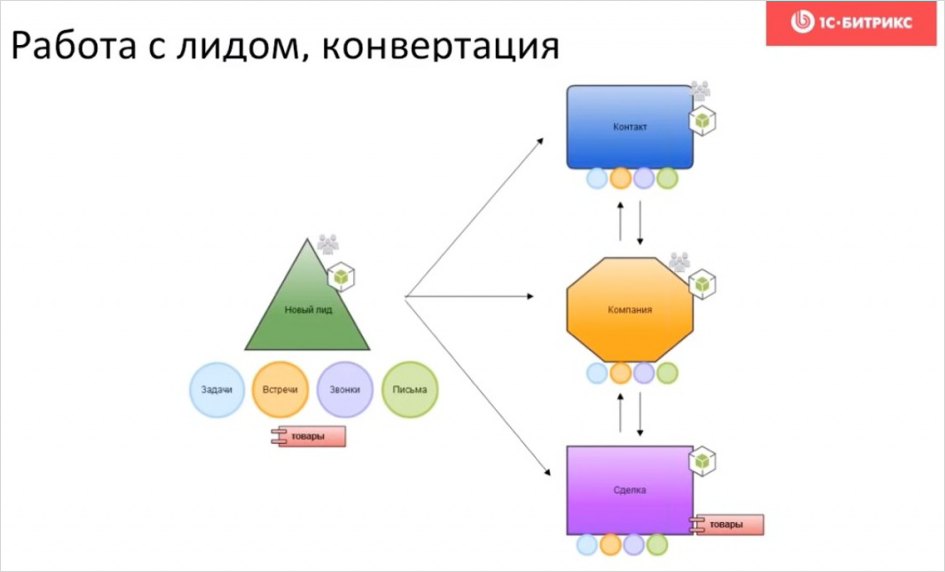

# Общая информация

CRM (Customer Relationship Management System - система управления взаимоотношениями с клиентами) – это система управления продажами, которая оптимизирует работу с клиентами и сопровождает их от первого контакта до финальной сделки.

Каждое холодное обращение, каждая зацепка с потенциальным клиентом это [Лид](./11_Лид/00_Описание), т.е. любая минимальная информация - будь то номер телефона, адрес электронной почты или сообщение из социальной сети.

После добавления лидов задачей менеджера является привлечь клиента, запланировать звонки, письма и встречи. Такая запланированная активность называется [Дело](./30_Дело/index). После успешной обработки менеджер может конвертировать лид в [контакт](./12_Контакт/00_Описание) или [компанию](./13_Компания/00_Описание), а в случае продажи - [в сделку](./14_Сделка/00_Описание). 



Помимо основных сущностей участвующих в процессах CRM существуют так же вспомогательные, зачастую не участвующие явно в процессе или обеспечивают собственную логику работу. К ним относятся: [Счета](./22_Счет), [Предложения](./23_Предложение), [Заказы](./23_Заказ/index).

# Перед использованием API

Перед использованием любого метода необходимо проверить чтобы модуль CRM был подключен на странице. Любой метод, подразумевающий использование вне контекста CRM (отдельные страницы, классы) должны предусматривать ситуацию, когда модуль CRM был отключен или удален с портала.

```php
use \Bitrix\Main;

if ( Main\Loader::IncludeModule('crm') )
{
    // Модуль подключен
}
```

# Изучение модуля

Модуль CRM не из простых. Каждая сущность не описывается лишь одной таблицей, а для некоторых сущностей используется более 5 связанных по определенным правилам таблиц. Мы рекомендуем начать изучение модуля с изучения [справочников](./01_Словари/10_Справочники), объяснения [типов полей и структур данных](./01_Словари/30_Структуры_данных) и их взаимоотношений.