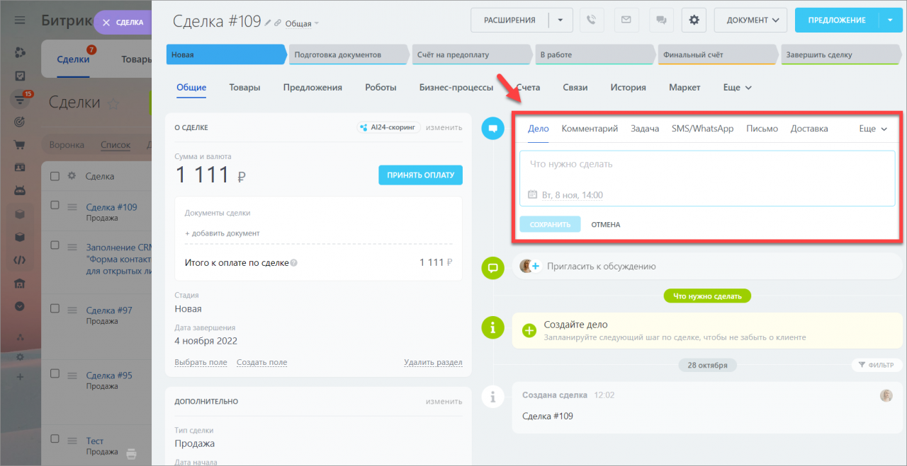

# Универсальное дело (ToDo)

Общее дело (todo-дело, универсальное дело) - это основной используемый тип "Дела", который пришел на замену устаревшим делам "Звонок", "Встреча".



## API

Во всех нижеследующих примерах api мы делаем ряд следующих предположений:
1. Модуль crm уже подключен к странице
2. Подключены следующие сокращения:
```php
use \CCrmOwnerType,
	\Main\Type\DateTime,
	\Bitrix\Crm\ItemIdentifier,
	\Bitrix\Crm\Activity\Entity\ToDo,
	\Bitrix\Crm\Activity\AutocompleteRule
	;
```
3. В переменной `$entityItemIdentifier` находится объект класса `\Bitrix\Crm\ItemIdentifier` для которого мы выполняем работу.
В рамках примеров, мы предположим что работам со сделкой (`\CCrmOwnerType::Deal`) под ID:16.
```php
$entityItemIdentifier = new ItemIdentifier(CCrmOwnerType::Deal, 16);
``` 

### Создание дела

Для создания простого дело достаточно заполнить всего пару полей:

```php
$todo = (new ToDo($entityItemIdentifier))
	->setDescription("Displayed text");

// Replace user id with activity id or deal assigned by id
// If not setted - current authorized user
$responsibleId = 1;
$todo->setResponsibleId($responsibleId);

/**
 * @var Bitrix\Main\Result
 */
$saveResult = $todo->save();
```

Дополнительно можно указать следующие параметры:

1. Отключение проверки прав.
По-умолчанию метод учитывает права текущего пользователя, относительно сущности к которой пытается изменить дело. Если вы хотите проигнорировать права, то перед вызовом метода сохранение необходимо отключить соответствующую проверку:
```php
$todo->setCheckPermissions(false);
```

2. Установить крайний срок
```php
$todo->setDeadline( DateTime::createFromTimestamp(strtotime('20.01.2023 10:00:00')) );
```

3. Установить автоматическое поведение:
- `AutocompleteRule::NONE` - ничего не делать
- `AutocompleteRule::AUTOMATION_ON_STATUS_CHANGED` - автоматически завершать при изменении стадии

```php
$todo->setAutocompleteRule(AutocompleteRule::NONE);
```


### Редактирование дела

Редактирование осуществляется путем вызова метода `save`, знакомого читателю из примера создания элемента на существующем объекте.
Предположим у нас имеется некоторый объект `$todo` который мы уже получили из базы данных каким-либо образом.

```php
// If we want to redefine entity
//$todo->setOwner($newEntityItemIdentifier);

$newResponsibleId = 123;

$todo->setResponsibleId($newResponsibleId);
$todo->setDescription("New activity description");

$todo->setDeadline( DateTime::createFromTimestamp(strtotime('20.01.2023 10:00:00')));
// Or unset deadline:
// $todo->setDeadline(null);

$todo->setAutocompleteRule( AutocompleteRule::AUTOMATION_ON_STATUS_CHANGED );

/**
 * @var Bitrix\Main\Result
 */
$saveResult = $todo->save();
```


### Удаление дела

Отдельного метода на удаления дела нет, воспользуйтесь [общим api по удалению дел](./00_Общее_API#udalenie-dela).

### Получение дела по его ID

```php
/**
 * Suggested 'todo' activity id
 * @var integer
 */
$activityId = 123;

/**
 * @var null|ToDo
 */
$todoEntity = ToDo::load($entityItemIdentifier, $activityId);
```

### Поиск дела

Отдельного api на поиск и получения всех дел нет.
Воспользуйтесь [общим api](./00_Общее_API).