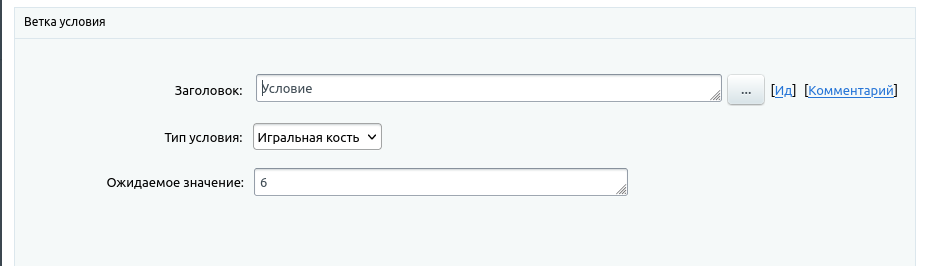
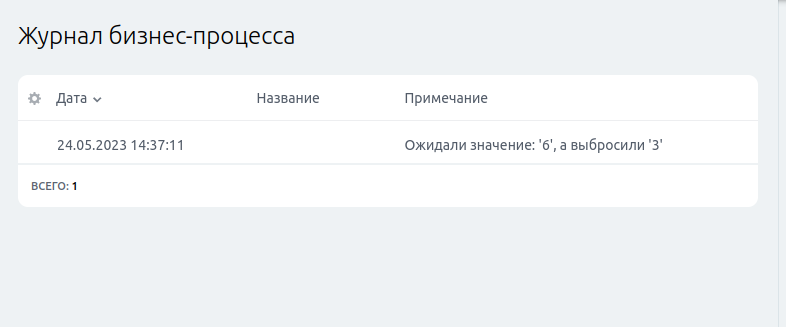

# Свои условия

[TOC]

В рамках шаблона бизнес процессов помимо действия (активити, `activity`) есть еще и условия (`condition`). Условия это особый подвид активити, который может быть использован в блоках "Условие" и "Цикл", наряду с "Полем документа", "PHP код", "Смешанное" и "Истина". 

>Для нетерпеливых, есть [оформленный пример кода на github](https://github.com/gromdron/bitrix-activity-dicecondition)

>Мы будем рассматривать условие на примере игральной кости (`dice`). Попадая в условие мы будем выбрасывать случайное число от 1 до 6 и в случае если это число то, которое запросил пользователь будем решать выполняется условие или нет. Для этого с параметрами условия будем запрашивать какое число мы ожидаем.

## Расположение

Условия, как и активити могут располагаться в следующих местах (путь указан от document root):
- `/local/activities`
- `/local/activities/custom`
- `BX_ROOT/activities/custom`
- `BX_ROOT/activities/bitrix`
- `BX_ROOT/modules/bizproc/activities`

Порядок поиска является приоритетным, т.е. директории будут перебираться последовательно пока не будет найдена директория с условием.
`BX_ROOT` - это константа содержащая путь к директории битрикса. По-умолчанию равна `/bitrix`.

## Файловая структура

По своему строению и расположению условия похожи на активити, за исключением того, что используют ключевое слово `condition` вместо `activity`. Для нашего случая будет использоваться название активити `dicecondition` (от англ. `dice condition`) и располагать мы будем ее в `/local/activities/custom`.
Структура нашего условия:
```
/local/activites/custom/
| -> dicecondition
| -> | -> .description.php
| -> | -> properties_dialog.php
| -> | -> dicecondition.php
| -> | -> lang
| -> | -> | -> ru
| -> | -> | -> | -> .description.php
| -> | -> | -> | -> properties_dialog.php
| -> | -> | -> | -> dicecondition.php
```

Рассмотрим подробнее содержимое директории: `/local/activites/custom/dicecondition`.

Файл `.description.php` будет содержать мета-информацию описывающую наше условие (аналог `.description.php` в компонентах)
Файл `properties_dialog.php` будет содержать код для визуального отображения (аналог `templates/.default/template.php` в компонентах)
Файл `dicecondition.php` будет содержать основную логику нашего активити (аналог `class.php` в компонентах)
Директория `lang` с языковыми фразами.


### Файл `.description.php`

Основная задача файла - установить переменную `$arActivityDescription` как массив описывающий условие.

| Ключ     | Тип    | Описание                                       |
|:---------|--------|------------------------------------------------|
| `NAME`   | string | Отображаемое название условия                  |
| `TYPE`   | enum   | Тип активити. В случае условия - **condition** |
| `FILTER` | array  | Структура содержащая ограничения для условия   |

Немного о ключе `FILTER`: для активити (и для условия) можно задавать ограничения видимости - включать (`INCLUDE`) или выключать (`EXCLUDE`) для определенного типа. Например, можно указать чтобы условие было доступно только в сделках:
```php
'FILTER' => [
	'INCLUDE' => [
		['crm', 'CCrmDocumentDeal'],
	],
],
```

Или например отключить условие для какого-нибудь смарт-процесса:
```php
'FILTER'      => [
	'EXCLUDE' => [
		['crm', "Bitrix\\Crm\\Integration\\BizProc\\Document\\Dynamic", "DYNAMIC_123"],
	],
],
```

Поскольку мы не хотим ставить ограничения на наше условие, то содержимое файла будет следующим:
```php
<? if (!defined("B_PROLOG_INCLUDED") || B_PROLOG_INCLUDED!==true) die();

use \Bitrix\Main\Localization\Loc;

$arActivityDescription = [
	"NAME" => Loc::getMessage("DICE_DESCR_NAME"),
	"TYPE" => "condition",
];
```

Сразу же создадим lang-файл `lang/ru/.description.php`:
```php
<? if (!defined("B_PROLOG_INCLUDED") || B_PROLOG_INCLUDED!==true) die();
$MESS['DICE_DESCR_NAME'] = "Игральная кость";
```

### Файл `properties_dialog.php`

Содержимое файла является php-кодом, чья задача вывести дополнительный html на страницах, где используется условия.
Для условий можно оставить файл пустым, но наше условие содержит один изменяемый параметр - ожидаемое значение кубика.

Важно помнить что данная страница открывается в рамках существующей страницы с версткой, а значит мы должны адаптировать свое отображение.
Верстка на странице выполнена в табличном стиле вида:

```html
<table>
	<tr>
		<td></td>
		<td></td>
	</tr>

	<!-- properties_dialog.php placed here-->

	<tr>
		<td></td>
		<td></td>
	</tr>
</table>
```

Кроме того, в рамках страницы нам доступны различные переменные, которые зависят от основного файла.
Обычно в списке переменных находится `$arCurrentValues` - ассоциативный массив текущих значений.

Поэтому содержимое нашего файла будет вида:
```php
<?php if (!defined("B_PROLOG_INCLUDED") || B_PROLOG_INCLUDED!==true) die();
use \Bitrix\Main\Localization\Loc;
?>
<tr>
	<td class='adm-detail-content-cell-l' align='right' width='40%'><?=Loc::getMessage('DICE_FIELD_NUMBER')?>:</td>
	<td class='adm-detail-content-cell-r' width='60%' valign='top'>
		<textarea rows="1" cols="40" name='Number'><?= htmlspecialcharsbx($arCurrentValues['Number']) ?></textarea>
	</td>
</tr>
```

Сразу же создадим lang-файл `lang/ru/properties_dialog.php`:
```php
<? if (!defined("B_PROLOG_INCLUDED") || B_PROLOG_INCLUDED!==true) die();
$MESS['DICE_FIELD_NUMBER'] = "Ожидаемое значение";
```


### Файл `dicecondition.php`

Файл содержащий php-класс, который описывает условие.

Название класса формируется специальным образом: `CBP` + код активити (название директории, регистр значения не имеет) и он должен быть наследником `CBPActivityCondition`.
Таким образом, для нашего условия он будет называться `CBPDiceCondition`.

Конструктор условия принимает один аргумент - массив информации об активити вызывающей условие и сами значения для условий. Наша задача обработать эти данные и получить необходимые для работы переменные в данном случае это "Ожидаемое значение" (`Number`). Поскольку ожидаемое значение обязательно, по-умолчанию будем ждать число 6.

За основное действие (бизнес смысл) отвечает метод `Evaluate(CBPActivity $ownerActivity): bool`, который примет один аргумент - активити использующее условие (либо "Условие" либо "Цикл"). Вернуть он должен булево значение (в случае если условие выполнено - `true`).

Поскольку наше условие подразумевает наличие параметров, то нам необходимо так же реализовать статические методы `GetPropertiesDialog`, `ValidateProperties`, `GetPropertiesDialogValues` отвечающие за возврат html-верстки параметров (`properties_dialog.php`), валидацию введенных значений и парсинг введенных данных из http-запроса в данные активити.

```php
<? if (!defined("B_PROLOG_INCLUDED") || B_PROLOG_INCLUDED!==true)die();

use \Bitrix\Bizproc;
use \Bitrix\Main\Localization\Loc;

class CBPDiceCondition
	extends CBPActivityCondition
{
	public $number = 6;

	public function __construct( $activityData )
	{
		$this->number = $activityData['Number'];
	}

	/**
	 * @param  CBPActivity $ownerActivity
	 * @return bool If success 'true' otherwise 'false'
	 */
	public function Evaluate( CBPActivity $ownerActivity )
	{
		try
		{
			$random = rand(1, 6);

			$this->writeToTrackingService(
				$ownerActivity, 
				Loc::getMessage('DICE_ACTIVITY_ROLL', [
					'#EXPECTED#' => $this->number,
					'#GOT#' => $random
				]), 
				0, 
				\CBPTrackingType::Report
			);

			return $random==$this->number;
		}
		catch( \Throwable $e )
		{
			$this->writeToTrackingService(
				$ownerActivity, 
				$e->getMessage(), 
				0, 
				\CBPTrackingType::Error
			);
		}

		return false;
	}

	/**
	 * Polyfill: Write to process log
	 * 
	 * @param  CBPActivity       $ownerActivity     Owner activity
	 * @param  string            $message           Log message
	 * @param  integer           $modifiedBy        Log by
	 * @param  \CBPTrackingType $trackingType       Log level
	 * @return void
	 */
	protected function writeToTrackingService( CBPActivity $ownerActivity, $message = "", $modifiedBy = 0, $trackingType = -1)
	{
		$trackingService = $ownerActivity->workflow->GetService("TrackingService");
		if ($trackingType < 0)
			$trackingType = \CBPTrackingType::Custom;

		$trackingService->Write(
			$ownerActivity->GetWorkflowInstanceId(),
			$trackingType,
			$ownerActivity->getName(),
			$ownerActivity->executionStatus,
			$ownerActivity->executionResult,
			($ownerActivity->IsPropertyExists("Title") ? $ownerActivity->Title : ""),
			$message,
			$modifiedBy
		);
	}

	/**
	 * Return rendered visual file of activity
	 * 
	 * @param array  $documentType         Document type [<module>, <entity>, <sub code>]
	 * @param array  $arWorkflowTemplate   Workflow template array
	 * @param array  $arWorkflowParameters Workflow parameters
	 * @param array  $arWorkflowVariables  Workflow variables
	 * @param array  $defaultValue         Default variables (first execution)
	 * @param array  $arCurrentValues      After apply form
	 * @param string $formName             HTML form tag name
	 * @param array  $popupWindow          Popup window data
	 * @param string $currentSiteId        Current website code
	 * @param array  $arWorkflowConstants  Workflow constants
	 */
	public static function GetPropertiesDialog(
		$documentType,
		$arWorkflowTemplate,
		$arWorkflowParameters,
		$arWorkflowVariables,
		$defaultValue,
		$arCurrentValues = null,
		$formName,
		$popupWindow,
		$currentSiteId,
		$arWorkflowConstants
	)
	{
		$runtime = \CBPRuntime::GetRuntime();

		if ( !is_array($arCurrentValues) )
		{
			$arCurrentValues = [
				"Number" => $defaultValue['Number']
			];
		}

		return $runtime->ExecuteResourceFile(
			__FILE__,
			"properties_dialog.php",
			[
				"arCurrentValues" => $arCurrentValues
			]
		);
	}

	/**
	 * Validate values
	 * 
	 * @param array                        $values All data from activity
	 * @param CBPWorkflowTemplateUser|null $user   Who edit current template
	 * @return array  List of errors
	 */
	public static function ValidateProperties($values = null, CBPWorkflowTemplateUser $user = null)
	{
		$arErrors = [];

		$values = is_array($values)? $values : [];

		$values['Number'] = array_key_exists('Number', $values)
			? intval($value['Number'])
			: 0
			;

		if ( $values['Number'] > 6 || $values['Number'] < 1 )
		{
			$arErrors[] = [
				"code" => "",
				"message" => Loc::getMessage("DICE_ACTIVITY_INCORRECT_NUMBER"),
			];
		}

		return array_merge(
			$arErrors,
			parent::ValidateProperties($values, $user)
		);
	}

	/**
	 * Return dialog values or null if error
	 * 
	 * @param string     $documentType         Document type [<module>, <entity>, <sub code>]
	 * @param array      $arWorkflowTemplate   Array with workflow template
	 * @param array      $arWorkflowParameters Array with workflow parameters
	 * @param array      $arWorkflowVariables  Array with workflow variables
	 * @param array|null $arCurrentValues      null or array with values
	 * @param array      &$arErrors            array
	 * @param array      $arWorkflowConstants  Array with workflow constants
	 */
	public static function GetPropertiesDialogValues(
		$documentType,
		$arWorkflowTemplate,
		$arWorkflowParameters,
		$arWorkflowVariables,
		$arCurrentValues,
		&$arErrors,
		$arWorkflowConstants
	)
	{
		$arErrors = array();

		if (
			!array_key_exists("Number", $arCurrentValues)
			|| $arCurrentValues["Number"] == ''
			|| $arCurrentValues["Number"] > 6
			|| $arCurrentValues["Number"] < 1
		)
		{
			$arErrors[] = array(
				"code" => "",
				"message" => Loc::getMessage("DICE_ACTIVITY_INCORRECT_NUMBER"),
			);
			return null;
		}

		$arErrors = self::ValidateProperties(
			$arCurrentValues,
			new CBPWorkflowTemplateUser(CBPWorkflowTemplateUser::CurrentUser)
		);
		
		if (count($arErrors) > 0)
			return null;

		return $arCurrentValues;
	}
}
```


>В своем `condition` мы использовали некоторое подобие полифила `writeToTrackingService`. Дело в том, что условие это не совсем активити и у него нет доступа к стандартной функции, поэтому мы реализовали подобное условие для записи в Журнал бизнес процесса. Это очень удобно при отладке, хоть и не обязательно.


Сразу же создадим lang-файл `lang/ru/dicecondition.php`:
```php
<? if (!defined("B_PROLOG_INCLUDED") || B_PROLOG_INCLUDED!==true) die();
$MESS['DICE_ACTIVITY_ROLL'] = "Ожидали значение: '#EXPECTED#', а выбросили '#GOT#'";
$MESS['DICE_ACTIVITY_INCORRECT_NUMBER'] = "Ожидаемое значение не определено или не корректно";
```

## Скриншоты

Пример настроек условия:


Пример записи в логе:
